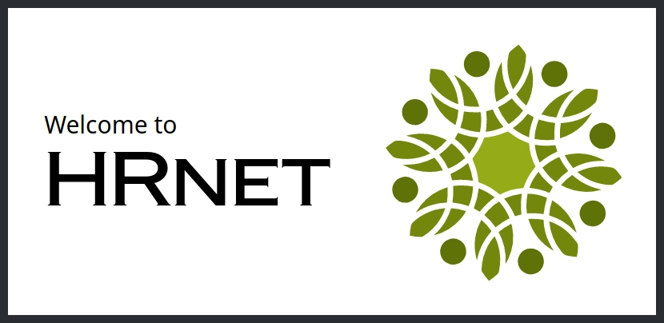

## Description

This project is a new version of the HR web application : HRnet.

The previous one was using jQuery and wasn't responsive. This one has been built using React and every jQuery plugin has been converted into React components. Using TailwindCSS, it is now also responsive.

## Installation

To run this project on your local machine, follow these steps:

1. Clone the repository onto your machine using `git clone https://github.com/ChuckBDT/OC-14-HRnet`
2. Navigate into the project directory with `cd oc-14-hrnet`
3. Install dependencies with `npm install`
4. Start the development server with `npm run dev`

## Built With

- [Vite](https://vitejs.dev/) - Build tool and development server
- [React](https://reactjs.org/) - JavaScript library for building user interfaces
- [TailwindCSS](https://tailwindcss.com/) - CSS framework for building responsive and customizable UIs
- [React Hook Form](https://react-hook-form.com/) - Library for building forms in React with easy-to-use validation
- [Revolver-Modal](https://www.npmjs.com/package/revolver-modal) - Library for building modals in React

## Contributing

If you would like to contribute to this project, please follow these steps:

1. Fork the repository
2. Create a new branch (`git checkout -b feature/<feature-name>`)
3. Make and commit your changes (`git commit -am 'Add some feature'`)
4. Push to the branch (`git push origin feature/<feature-name>`)
5. Create a new pull request

## License

This project is licensed under the [MIT License](LICENSE).
